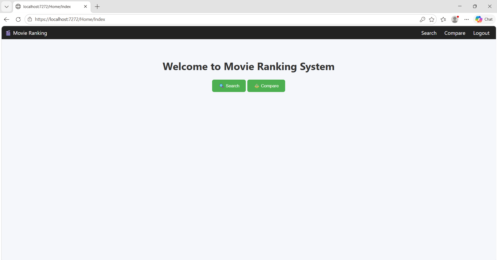
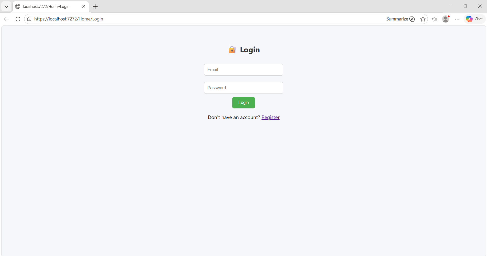
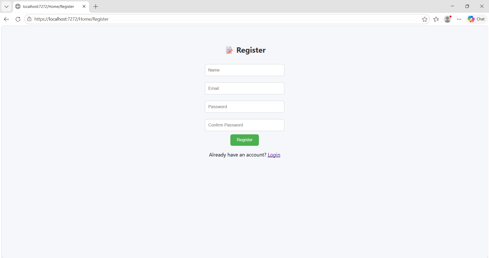
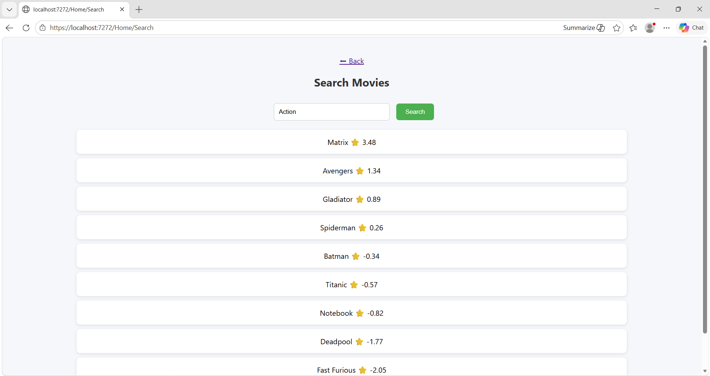
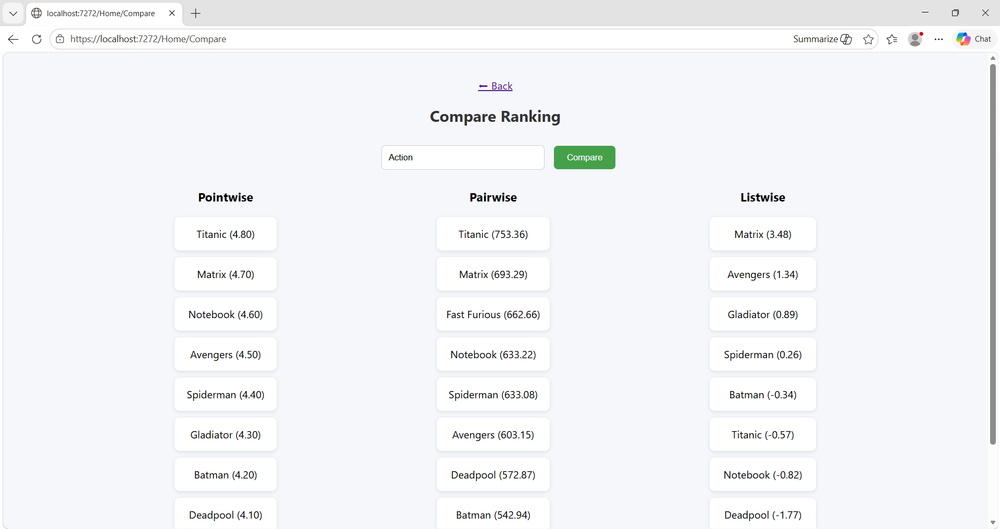
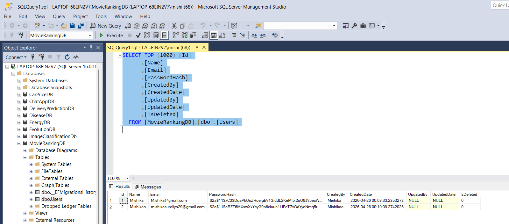

# 🎬 Movie Ranking System (ML.NET + ASP.NET Core)

## 🚀 Overview

The **Movie Ranking System** is an AI-powered web application that ranks movies based on user search queries using **Machine Learning (LambdaMART - LightGBM)**.

It demonstrates **Pointwise, Pairwise, and Listwise ranking techniques** and includes full-stack features like authentication, database integration, and logging.

---

## 🎯 Features

### 🔍 Movie Ranking

* Search movies by genre/query
* ML-based ranking using **LambdaMART**
* Smarter results than simple sorting

### ⚖️ Compare Ranking Methods

* Pointwise Ranking
* Pairwise Ranking
* Listwise Ranking (ML Model)
* Side-by-side comparison

### 🔐 Authentication System

* User Registration & Login
* Password validation (strong rules)
* JWT-based authentication
* Secure APIs

### 🗄️ Database

* SQL Server with Entity Framework Core
* Audit fields:

  * CreatedBy / CreatedDate
  * UpdatedBy / UpdatedDate
  * IsDeleted (Soft Delete)

### 📊 Logging

* Implemented using **Serilog**
* Logs stored in files
* Tracks:

  * Login/Register attempts
  * Errors
  * API calls

---

## 🧠 Machine Learning Concept

### 📌 Algorithm Used

* **LambdaMART (LightGBM Ranking)**

### 📌 Ranking Types

1. **Pointwise** → Predict individual score
2. **Pairwise** → Compare items
3. **Listwise** → Optimize full ranking (Best)

### 📌 Evaluation Metrics

* NDCG (Normalized Discounted Cumulative Gain)
* MAP (Mean Average Precision)

---

## 🏗️ Tech Stack

* **Frontend**: ASP.NET Core MVC (Razor Views)
* **Backend**: ASP.NET Core Web API
* **ML**: ML.NET (LightGBM Ranking)
* **Database**: SQL Server (EF Core)
* **Auth**: JWT Authentication
* **Logging**: Serilog

---

## 📸 Screenshots

### 🏠 Home Page



### 🔐 Login Page



### 📝 Register Page



### 🔍 Search Page



### ⚖️ Compare Page



### Database



---

## 📂 Project Structure

```
MovieRankingSystem/
│
├── Controllers/
├── Models/
├── Services/
├── Data/
├── Views/
├── wwwroot/
├── Dataset/
├── MLModel/
└── Logs/
```

---

## ⚙️ Setup Instructions

### 1️⃣ Clone Project

```
git clone https://github.com/your-username/movie-ranking-system.git
```

### 2️⃣ Configure Database

Update `appsettings.json`:

```
"ConnectionStrings": {
  "DefaultConnection": "Server=.;Database=MovieRankingDB;Trusted_Connection=True;"
}
```

### 3️⃣ Run Project

```
dotnet build
dotnet run
```

### 4️⃣ Open in Browser

```
https://localhost:xxxx
```

---

## 🔑 JWT Authentication

* Login generates JWT token
* Token used to access secured APIs
* Swagger supports **Authorize button**

---

## 🧪 Sample Flow

1. Register user
2. Login → get JWT token
3. Search movies
4. Compare ranking methods
5. View logs

---

## 📈 Future Enhancements

* Recommendation system
* User preferences personalization
* UI improvements (animations, dashboard)
* Real-time feedback system

---

## 👩‍💻 Author

**Mishika Sureliya**

---

## ⭐ Key Highlight

👉 This project demonstrates **end-to-end ML integration in a web application**, combining:

* Machine Learning
* Backend APIs
* Authentication
* Database
* UI

---

## 📌 License

This project is for educational purposes.
